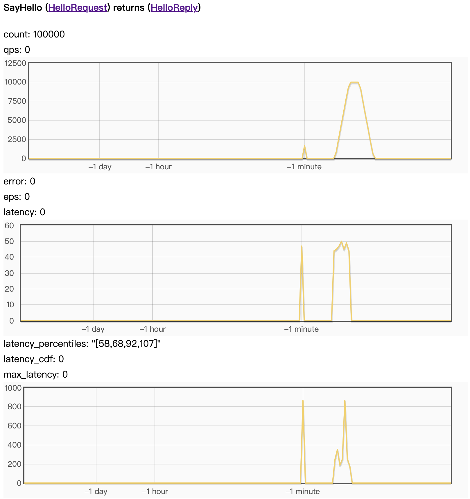
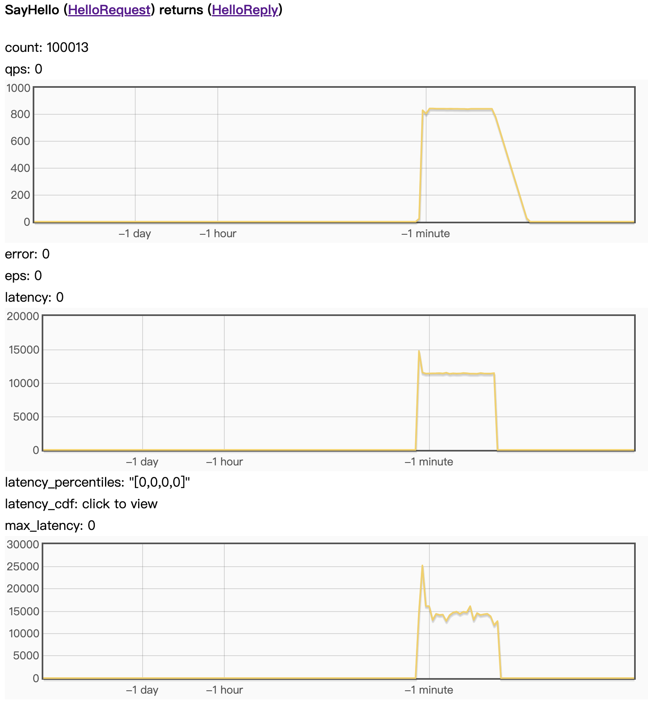

## Benchmarks

### Benchmark 1: `heavy_computation=0`

```text
$ make && ./echo_server -bthread_concurrency=4 -heavy_computation_count=0
make: Nothing to be done for 'all'.
I0207 02:48:51.402909 414922 src/brpc/server.cpp:1114] Server[GreeterImpl] is serving on port=50051.
I0207 02:48:51.403136 414922 src/brpc/server.cpp:1117] Check out http://gserver:50051 in web browser.
```

```text
$ ./echo_client
I0207 02:52:53.351508 418504 client.cpp:75] Received response from 0.0.0.0:50051 to 127.0.0.1:57264: Hello grpc_req_from_brpc latency=1451us
I0207 02:52:54.352302 418504 client.cpp:75] Received response from 0.0.0.0:50051 to 127.0.0.1:57264: Hello grpc_req_from_brpc latency=523us
I0207 02:52:55.352917 418504 client.cpp:75] Received response from 0.0.0.0:50051 to 127.0.0.1:57264: Hello grpc_req_from_brpc latency=399us
I0207 02:52:56.353419 418504 client.cpp:75] Received response from 0.0.0.0:50051 to 127.0.0.1:57264: Hello grpc_req_from_brpc latency=318us
I0207 02:52:57.353975 418504 client.cpp:75] Received response from 0.0.0.0:50051 to 127.0.0.1:57264: Hello grpc_req_from_brpc latency=383us
I0207 02:52:58.354434 418504 client.cpp:75] Received response from 0.0.0.0:50051 to 127.0.0.1:57264: Hello grpc_req_from_brpc latency=297us

$ ./echo_client
I0207 02:53:01.833648 418906 client.cpp:75] Received response from 0.0.0.0:50051 to 127.0.0.1:41616: Hello grpc_req_from_brpc latency=1326us
I0207 02:53:02.834279 418906 client.cpp:75] Received response from 0.0.0.0:50051 to 127.0.0.1:41616: Hello grpc_req_from_brpc latency=419us
I0207 02:53:03.834883 418906 client.cpp:75] Received response from 0.0.0.0:50051 to 127.0.0.1:41616: Hello grpc_req_from_brpc latency=425us
I0207 02:53:04.835520 418906 client.cpp:75] Received response from 0.0.0.0:50051 to 127.0.0.1:41616: Hello grpc_req_from_brpc latency=465us
I0207 02:53:05.836064 418906 client.cpp:75] Received response from 0.0.0.0:50051 to 127.0.0.1:41616: Hello grpc_req_from_brpc latency=376us
I0207 02:53:06.836554 418906 client.cpp:75] Received response from 0.0.0.0:50051 to 127.0.0.1:41616: Hello grpc_req_from_brpc latency=348us
```

```text
./dist/ghz --insecure --proto /home/xiaolin/ghq/github.com/apache/brpc/example/grpc_c++/helloworld.proto --call helloworld.Greeter.SayHello -d '{"name": "Joe"}' -n 100000 --connections=10 --concurrency=10 gserver:50051

Summary:
  Count:        100000
  Total:        5.85 s
  Slowest:      2.67 ms
  Fastest:      0.08 ms
  Average:      0.20 ms
  Requests/sec: 17101.86

Response time histogram:
  0.078 [1]     |
  0.337 [93003] |∎∎∎∎∎∎∎∎∎∎∎∎∎∎∎∎∎∎∎∎∎∎∎∎∎∎∎∎∎∎∎∎∎∎∎∎∎∎∎∎
  0.596 [3297]  |∎
  0.856 [2871]  |∎
  1.115 [740]   |
  1.375 [73]    |
  1.634 [5]     |
  1.894 [4]     |
  2.153 [2]     |
  2.413 [2]     |
  2.672 [2]     |

Latency distribution:
  10 % in 0.12 ms
  25 % in 0.14 ms
  50 % in 0.16 ms
  75 % in 0.20 ms
  90 % in 0.28 ms
  95 % in 0.47 ms
  99 % in 0.83 ms

Status code distribution:
  [OK]   100000 responses
```

brpc internal metrics: 


### Benchmark 2: `heavy_computation=10000000`

```text
$ make && ./echo_server -bthread_concurrency=4 -heavy_computation_count=10000000
make: Nothing to be done for 'all'.
I0207 02:56:20.614172 421541 src/brpc/server.cpp:1114] Server[GreeterImpl] is serving on port=50051.
I0207 02:56:20.614431 421541 src/brpc/server.cpp:1117] Check out http://gserver:50051 in web browser.
```

```text
$ ./echo_client
I0207 02:57:19.281266 422530 client.cpp:75] Received response from 0.0.0.0:50051 to 127.0.0.1:55752: Hello grpc_req_from_brpc latency=15938us
I0207 02:57:20.307019 422530 client.cpp:75] Received response from 0.0.0.0:50051 to 127.0.0.1:55752: Hello grpc_req_from_brpc latency=25538us
I0207 02:57:21.332737 422530 client.cpp:75] Received response from 0.0.0.0:50051 to 127.0.0.1:55752: Hello grpc_req_from_brpc latency=25530us
I0207 02:57:22.357898 422530 client.cpp:75] Received response from 0.0.0.0:50051 to 127.0.0.1:55752: Hello grpc_req_from_brpc latency=24982us
I0207 02:57:23.383491 422530 client.cpp:75] Received response from 0.0.0.0:50051 to 127.0.0.1:55752: Hello grpc_req_from_brpc latency=25424us
I0207 02:57:24.409092 422530 client.cpp:75] Received response from 0.0.0.0:50051 to 127.0.0.1:55752: Hello grpc_req_from_brpc latency=25430us

$ ./echo_client
I0207 02:57:26.034599 422865 client.cpp:75] Received response from 0.0.0.0:50051 to 127.0.0.1:55766: Hello grpc_req_from_brpc latency=15218us
I0207 02:57:27.060435 422865 client.cpp:75] Received response from 0.0.0.0:50051 to 127.0.0.1:55766: Hello grpc_req_from_brpc latency=25567us
I0207 02:57:28.086198 422865 client.cpp:75] Received response from 0.0.0.0:50051 to 127.0.0.1:55766: Hello grpc_req_from_brpc latency=25564us
I0207 02:57:29.111938 422865 client.cpp:75] Received response from 0.0.0.0:50051 to 127.0.0.1:55766: Hello grpc_req_from_brpc latency=25537us
I0207 02:57:30.136972 422865 client.cpp:75] Received response from 0.0.0.0:50051 to 127.0.0.1:55766: Hello grpc_req_from_brpc latency=24847us
I0207 02:57:31.157896 422865 client.cpp:75] Received response from 0.0.0.0:50051 to 127.0.0.1:55766: Hello grpc_req_from_brpc latency=20745us
I0207 02:57:32.183574 422865 client.cpp:75] Received response from 0.0.0.0:50051 to 127.0.0.1:55766: Hello grpc_req_from_brpc latency=25505us
```

```text
./dist/ghz --insecure --proto /home/xiaolin/ghq/github.com/apache/brpc/example/grpc_c++/helloworld.proto --call helloworld.Greeter.SayHello -d '{"name": "Joe"}' -n 100000 --connections=10 --concurrency=10 gserver:50051

Summary:
  Count:        100000
  Total:        118.53 s
  Slowest:      16.33 ms
  Fastest:      9.70 ms
  Average:      11.59 ms
  Requests/sec: 843.67

Response time histogram:
  9.702  [1]     |
  10.365 [37]    |
  11.028 [4247]  |∎∎∎
  11.691 [67732] |∎∎∎∎∎∎∎∎∎∎∎∎∎∎∎∎∎∎∎∎∎∎∎∎∎∎∎∎∎∎∎∎∎∎∎∎∎∎∎∎
  12.354 [21636] |∎∎∎∎∎∎∎∎∎∎∎∎∎
  13.017 [5603]  |∎∎∎
  13.680 [430]   |
  14.343 [160]   |
  15.006 [136]   |
  15.669 [14]    |
  16.332 [4]     |

Latency distribution:
  10 % in 11.19 ms
  25 % in 11.36 ms
  50 % in 11.56 ms
  75 % in 11.71 ms
  90 % in 11.84 ms
  95 % in 12.65 ms
  99 % in 12.93 ms

Status code distribution:
  [OK]   100000 responses
```

brpc internal metrics: 

